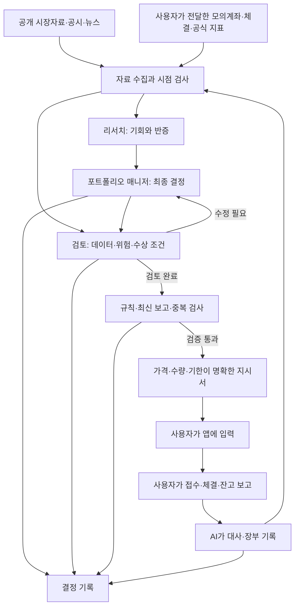

# AI 투자 실험 설계

버전: 0.3, 갱신일: 2026-09-08. 이 문서의 정책은 **AI가 선택한 실험 설계**이며 대회 자체의 규정은 [competition.md](competition.md)에 있다. 실제 진행 상태는 프로젝트 README와 로컬 실행 기록에서 확인한다. 사용자가 계좌 조회·주문 입력을 맡고 장중 요청에 수시 대응한다. 시장 점검은 사용자 요청과 실제 등록한 예약으로 시작할 수 있다. 구체적인 전달 양식과 예약 범위는 [수동 운영 절차](manual-operations.md)를 따른다.

## 1. 측정하려는 것

검증 질문은 다음과 같다.

> 사용자에게 투자 의견을 받지 않는 AI 에이전트 시스템이, 이 대회의 규칙과 제공된 정보·도구 환경 안에서 어떤 수익률을 기록하는가?

주요 결과는 공식 모의계좌의 최종 순수익률이다. 모델 단독의 능력과 프롬프트·데이터·도구·실행 방식의 효과가 함께 들어가므로 결과를 **이 시스템의 해당 기간 성과**로 표현한다. 한 대회만으로 보편적인 투자 우위나 실거래 재현성을 입증했다고 결론 내리지 않는다.

목표는 대회 규정 및 수상 조건을 충족하는 범위에서 최종 공식 수익률을 최대화하는 것이다. 수익률, 수상 자격, 실험 기록의 완전성을 각각 보고한다. 조건을 못 채운 성과나 손실도 삭제하지 않는다. 단순한 최고 순위 도달 확률을 높이기 위해 목적을 임의로 바꾸지 않는다.

## 2. 사용자의 투자 의견을 넣지 않는 방법

| 구분 | 처리 |
| --- | --- |
| 종목 추천, 시장 전망, 매수·매도 의견, 선호 업종 | 투자 판단 입력에서 제외 |
| 비중, 현금 비중, 투자 스타일, 매매 빈도, 추가 손실 한도 | AI가 결정하고 근거와 적용 시각 기록 |
| 참가·로그인·계좌 보고·데이터 공급·장중 대응 가능 여부 | 운영 입력으로 수용, 투자 의견과 구별 |
| 사용자가 AI 주문서를 그대로 입력하는 기본 실행 방식 | 운영 보조로 기록. 입력 지연·오류도 보존 |
| 사용자가 투자 전망에 따라 주문 종목·수량·가격·시점을 변경 | 투자 개입으로 기록, 이후 구간을 투자 의견 무개입 성과와 구별 |
| 오입력, 연락 지연, 대응 불가 | 운영 오류·제약으로 기록. 투자 의도가 있었는지와 구별 |
| 사용자의 중단·범위 변경 요청 | 존중하고 적용 시각·이유 기록 |

사람의 투자 성향을 대신 가정하지 않는다. 대회 한도보다 낮은 고정 종목 한도나 일률적인 손절 비율도 지금 임의로 강제하지 않는다. AI는 규정 안에서 집중·분산·현금 보유·전략 전환을 선택할 수 있다. 선택한 위험 정책은 주문 전에 문서화하고, 변경 시 이전 정책을 보존한다.

외부 뉴스와 리서치의 시장 의견은 AI가 스스로 수집한 투자 자료로 사용할 수 있다. 사용자가 골라준 종목만 분석하거나, 수익이 난 뒤 유리했던 외부 의견만 사후 추가하는 것은 허용하지 않는다.

## 3. 에이전트·사용자·검증 프로그램의 책임

처음부터 에이전트 수를 늘리지 않는다. 역할을 아래와 같이 나누되, 실제 별도 호출이 판단 품질·검증에 도움이 되는 경우에만 분리한다. 동일 모델의 여러 호출을 독립된 통계적 증거로 취급하지 않는다.



| 역할 | 책임 | 산출물 |
| --- | --- | --- |
| 자료 수집 | 시세·거래상태·공시·뉴스 수집, 사용자가 전달한 계좌 자료의 시점·읽기 오류 검토 | 버전이 있는 입력 스냅샷, 결측 목록 |
| 리서치 | 기회, 근거, 촉매, 불리한 시나리오, 체결 가능성 비교 | 후보와 제외 이유, 반증 조건 |
| 포트폴리오 매니저 | 매매·보류·현금 비중과 가격·수량·재검토 조건 결정 | 최종 의사결정 한 건 |
| 검토 | 사실 오류, 비용 누락, 집중 위험, 조건 미달, 근거의 약점 지적 | 규칙 위반과 투자상 이견을 구별한 검토 |
| 검증·기록 프로그램(구현 예정) | 보고된 상태로 규칙·지시서 중복 검사, 보고 파싱·대사 | 지시서·보고·원장 이벤트 |
| 사용자 | 계좌 조회, 지시된 주문의 입력·정정·취소, 접수·체결 결과 전달 | 화면 또는 텍스트 보고 |
| 평가·기록 | 공식값 대사, 성과 계산, 개입·장애·정정 기록 | 일별 장부와 최종 결과 |

검토 역할의 투자상 이견은 매니저가 근거를 남기고 받아들이거나 기각할 수 있다. 확정 규칙 위반, 잘못된 계좌, 결측된 필수 상태, 중복 주문은 입력용 지시 발행 전에 차단한다. 이 검사를 프로그램으로 구현하되, 현재는 AI가 보고된 사실을 검토하고 구현 여부를 구별한다. 검토 역할과 사용자가 투자 결정을 대신 변경하지 않는다.

## 4. 실행 전에 고정할 실험 조건

첫 모의주문 전 아래 항목을 실행 명세에 저장한다. 아직 확인되지 않은 값은 현재 `null`로 남기고, 실제 실행 시 확정한다.

- 실험 ID, 공식 대회 기간, **실제 실험 시작 시각**, 첫 잔고·보유·미체결 스냅샷.
- 사용 모델의 정확한 식별자, 공개된 버전·설정, 제공되는 경우 샘플링 설정.
- 프롬프트·대회 규칙·운영 코드의 버전 또는 해시.
- 데이터 공급원, 시세 지연, 사용자 계좌 보고 방식, 도구 권한, 실행 장치.
- 판단 주기, 재호출 상한, 데이터·계좌 보고 유효 시간, 호출·토큰·비용 집계 방식.
- 사용자 장중 수시 대응 조건, 측정한 보고·입력 지연, 지시서 입력 기한과 미체결 확인·취소 계획.
- AI가 정한 초기 위험 정책, 벤치마크, 정책 갱신 조건.

동일 시점의 응답을 여러 번 뽑아 성과가 좋아 보이는 답만 남기지 않는다. 초기 설계는 **스냅샷당 최종 결정 1건, 검토 후 수정 최대 1회**다. 여전히 필수 검증을 통과하지 못하면 `BLOCKED`, 충분한 투자 근거가 없으면 `HOLD`를 기록한다. 새로운 시장 정보가 들어오면 새 스냅샷과 결정 ID로 판단할 수 있다. 이 횟수 제한은 대회 규정이 아닌 실험 운영 기본값이다.

모델·프롬프트·판단 주기·위험 정책을 바꾸는 경우 변경 시각, 이전 값, 새 값, 변경 근거를 남긴다. 비교 실험에서 고정해야 할 구성 변경은 새 구간으로 표시하고, 이전 손익은 공식 누적 성과에서 제거하지 않는다. 자동 학습·전략 갱신을 쓸 경우 그 갱신 규칙도 미리 고정한다.

2026-09-08 09:56:54 KST에는 사용자의 반복 요청 부담을 줄이기 위해 같은 대화의 시장 점검 예약을 ACTIVE로 등록했다. 이는 운영상 호출 방식의 변경이며 투자 의견 개입이 아니다. 일반 거래일 09:10~15:10 KST의 20분 간격 점검이 예정되어 있고, 첫 예정 시각은 당일 10:10 KST다. 등록 시점에는 실제 자동 실행 성공을 확인하지 않았다. 설정·변경과 이후 실행·실패는 별도 운영 이벤트로 기록하며 기존 결정·스냅샷의 수동 재요청 안내는 당시 기록으로 보존한다.

## 5. 정보 시점과 데이터 품질

모든 자료는 `source`, `published_at` 또는 `market_time`, `retrieved_at`, `available_at`, 내용 해시를 가진다. `available_at`은 시스템이 그 자료를 실제 입력으로 사용할 수 있게 된 시각이다. 의사결정에는 `available_at <= decision_at`인 자료만 사용한다.

계좌 자료는 사용자의 화면 확인 시각 `observed_at`, AI 수신 시각 `received_at`, 입력 가능 시각 `available_at`을 구별한다. 화면·보고에 시각이 없으면 미확정으로 표시한다. 보고 사이에 계좌 상태를 연속 조회한 것으로 간주하지 않으며, 미체결 주문은 새 보고 전까지 체결될 수 있는 상태로 관리한다.

예약 시장조회는 계좌 보고의 관측 시각을 갱신하지 않는다. 매 거래일 첫 판단에 당일 계좌 확인이 없으면 필요한 자료를 한 번 요청하고, 같은 날 초기 빈 계좌는 저장된 정책 범위 안에서만 조건부 이어 사용한다. 신규 주문 가격 판단에는 시장시각이 확인된 120초 이내 KRX 시세를 사용하며 NXT·통합 시세와 구별한다. 이 시간 한도는 AI 실행 정책이고, 종목 제한과 계좌·주문가능수량 확인을 대신하지 않는다.

모델의 기억, 검색 결과 요약만으로 현재가·뉴스 발생 시각·투자주의 상태를 확정하지 않는다. 원문에 접근할 수 없거나 시세가 지연되면 그 한계를 표시한다. 지연 시세를 실시간 주문 입력으로 취급하지 않는다. 상장폐지 종목이 빠진 과거 목록이나 사후 수정된 가격을 과거에 알았던 자료처럼 쓰지 않는다.

첫 버전의 관심 대상은 당시 허용되는 전체 국내 주식·ETF 범위에서 AI가 찾는다. 유동성·규모·업종 필터를 도입하면 AI 설계로 기록하고, 사용자가 좋아할 법한 종목을 추정해 넣지 않는다.

백테스트 결과는 검증 자료일 뿐 실전 대회 성적이 아니다. 이번 대회 기간의 결과를 이미 본 뒤 그 구간을 백테스트한 값은 사전 예측 성과로 표시하지 않는다.

## 6. 판단·검증·주문·체결의 연결

판단은 종목 코드, 매수/매도, 주문 유형, 가격, 수량, 입력 기한, 미체결 확인·취소 계획, 근거 자료 ID, 반증 조건, 예상 비용, 실행 후 노출을 명시한다. 장문의 내부 사고 과정 대신 검증 가능한 근거와 결정 요약을 저장한다.

AI와 향후 검증 프로그램은 입력용 지시 발행 전에 보고된 계좌·대회 그룹, 현금·보유 수량, 미체결 주문, 종목 제한, 시간, 단일 종목 한도, 데이터 유효성, 기존 지시 ID를 확인한다. 사용자는 입력 직전에 계좌·종목·가격·수량·기한이 지시와 일치하는지 확인한다. 상태가 달라지거나 기한이 만료되면 임의 수정하지 않고 미입력 사유를 전달한다. 수동 입력 지연을 고려해 지정가를 기본으로 하며, 시장가를 쓰려면 AI가 가격·현금 위험과 실행 조건을 별도로 명시한다.

```text
지시서: DRAFT → READY_FOR_USER → 입력 보고 대기
         └→ HOLD / BLOCKED       └→ 미입력 확인 시 EXPIRED / SUPERSEDED / NOT_ENTERED
앱 주문: 접수 보고 → ACKNOWLEDGED → PARTIALLY_FILLED → FILLED
                               └→ CANCELLED / REJECTED / 플랫폼 만료
보고 미수신: AWAITING_REPORT / 앱 상태 불명: UNKNOWN → 사용자 조회 보고로 상태 확정
```

지시서 발행은 주문 접수가 아니다. 보고가 없다고 같은 지시를 재입력하도록 요청하지 않는다. 사용자가 앱 주문번호·수량·시각과 공식 내역을 전달한 뒤 중복 여부를 판정한다. 부분 체결 후 취소되면 이미 체결된 수량은 유지한다. 지시 발행 역할은 하나이며, 사용자는 정해진 순서로 입력한다. 선행 매도 체결과 가용현금 확인이 필요한 매수는 그 보고 이후 발행한다.

예약 호출과 사용자 요청이 겹치면 시작 시 최신 실행·결정·활성 지시·결과 보고를 확인하고, 처리 중인 실행이나 이미 결정한 같은 스냅샷을 중복 진행하지 않는다. 발행 직전에도 상태를 다시 확인한다. 한 번에 활성 지시 묶음 하나만 유지하고 미보고·상태 불명 주문은 잠재 노출로 취급한다. 이 절차를 소프트웨어 잠금이나 자동 주문 검증이 구현된 증거로 사용하지 않는다.

입력 기한 만료는 앱에 접수된 주문을 취소하지 않는다. 미체결 유지·취소 시점과 조건은 별도로 지시하고 사용자의 취소 결과를 확인한다. 취소 요청 중 추가 체결될 수 있으므로 최종 잔량·누적 체결을 대사한다. 실제 입력 여부가 불명확하면 지시 기한이 지났어도 잠재적 주문 노출을 제거하지 않는다.

현금·보유·미체결·비용은 체결과 공식 잔고를 근거로 갱신한다. 로컬 원장과 플랫폼이 다르면 미해결 차이가 관련 주문의 실행 조건에 영향을 주는 동안 해당 주문을 보류하고 대사한다. 모의체결의 비현실적 특성을 의도적으로 이용해 성과를 부풀리는 전략은 사용하지 않는다.

## 7. 하루 운영 흐름

정확한 시각과 빈도는 실행 명세와 실제 등록한 예약에 기록한다. 장중 수시 대응 가능이라는 답변을 즉시 응답 보장으로 해석하지 않는다. 예약 활성 상태·실제 거래일·휴장·특별 시간을 확인하고, 범위 밖에서는 새 시장 조사·신규 지시를 만들지 않는다. 다만 이미 발행한 주문의 확인·취소 시한이나 새 미보고 위험은 필요한 사용자 안내를 먼저 처리한다. 컴퓨터·앱·네트워크·사용량 등의 조건에 따라 실행이 지연되거나 누락될 수 있으며, 놓친 시각을 소급 판단하거나 정시 완료를 보장하지 않는다.

1. 장 전 또는 첫 접속: 사용자 계좌 보고와 거래일·규정·종목 상태, 전일 장부, 새 공시·뉴스 확인.
2. 허용 세션 중: 예약 또는 사용자 요청으로 최신 스냅샷을 수집해 매매 또는 보류 결정, 검토 후 입력 기한이 있는 지시서 발행.
3. 입력 직후: 사용자의 접수 보고를 기록. 지정한 확인 시점과 후속 체결 보고를 기준으로 포지션·미체결 대사.
4. 새 중요 자료나 계좌 보고 도착 후: 필요한 경우 새 판단. 보고 사이의 미관측 상태는 불확실성으로 유지.
5. 장 마감 후: 사용자가 전달한 공식 수익률·회전율·인정 종목·거래일수 기록. 장 마감 평가는 잠정값으로 표시.
6. 결제·기업행사 반영 후 및 종료일: 사용자의 갱신된 공식 내역을 받아 저장. 19시경을 무조건 갱신 완료로 가정하지 않으며 최종 심사 정정은 새 이벤트로 추가.

모든 최종 판단은 다음 점검 방식을 기록한다. 수동 모드에서는 다음 사용자 판단 요청의 정확한 날짜·시각(KST)과 요청 문구·필요 자료를 적는다. 예약 활성 모드에서는 다음 예정 자동 점검 날짜·시각을 기록하고 사용자 조치가 필요할 때만 별도의 응답 요청 시각·자료를 안내한다. 예정 점검·응답 요청은 판단 완료·주문 입력 마감·미체결 확인·취소와 구별한다. 변화 없는 HOLD와 이미 알린 미해결 상태는 반복 알림 없이 기록하고, 실행 지시·의미 있는 변화·새롭거나 심화된 위험·조사 실패·필요한 조치 또는 시한 도래 때 알린다. 완료한 조사·판단의 원본과 블로그 기록 의무는 유지한다.

회전율·종목·거래일수는 공식 값을 매일 점검한다. 목표 달성을 마지막 날의 형식적 반복 거래에 의존하지 않는다. 정상적인 매매 기회와 비용을 함께 고려해 AI가 부족분에 대한 운영 계획을 세운다.

## 8. 성과 측정

| 지표 | 정의와 보고 기준 |
| --- | --- |
| 공식 누적 수익률 | 주최사 최종 값. 로컬 계산은 대사 용도이며 차이를 숨기지 않음 |
| AI 운영 구간 수익률 | 실제 시작 잔고부터 종료 잔고까지. 대회 누적 수익률과 시작점이 다르면 별도 표시 |
| 시장 대비 | 동일 시작·종료 시점의 KOSPI, KOSDAQ 지수 수익률 각각과 비교한 차이(%p) |
| 현금 기준선 | 지급 이자 없음 가정의 무매매 0% 기준선. 수상 자격 충족 전략으로 취급하지 않음 |
| 최대 낙폭 | 같은 관측 주기의 총자산에서 고점 대비 최대 하락률. 일별이면 장중 낙폭 미포착 명시 |
| 수상 조건 | 공식 회전율, 인정 체결 종목 수, 거래일수, 음수 수익률 여부, 최종 자격 |
| 매매 비용·체결 | 수수료·세금, 주문 대비 체결, 실행 지연, 확인 가능한 경우 슬리피지 |
| 시스템 운영 | 모델·도구 호출 수, 토큰, 확인 가능한 비용, 오류·복구 횟수 |
| 자율성 | 투자 의견 개입 수, 판단 변경 수. 수동 조회·입력·정정·취소 및 오입력·지연은 별도 집계 |

KOSPI·KOSDAQ 지수는 참고용 시장 지표다. 지수 수익률과 비용 차감 후 계좌 수익률의 차이를 비용까지 통제한 알파로 단정하지 않는다. 지수는 50% 한도·500% 회전율 등 대회 조건을 충족하는 경쟁 참가자가 아니다. 시작 시각과 맞는 지수 관측값이 없으면 비교 시작점을 명시하고 근사 비교로 표시한다.

추가 비교 전략이 필요하면 동일 데이터 시점·예산·비용·체결 가정을 사용하는 로컬 장부를 미리 등록한다. 공식 참가 성적과 혼합하지 않고, 모든 비교 결과를 보존한다. 현재 추가 전략 실행이나 복수 모델 경연은 시작하지 않았다.

```text
구간 수익률(외부 현금흐름이 없는 경우) = (종료 총자산 / 시작 총자산 - 1) × 100
시장 대비 차이(%p) = 같은 기간의 계좌 수익률(%) - 지수 수익률(%)
최대 낙폭(양수 %) = max_t(1 - 총자산_t / 이전 시점 포함 최고 총자산) × 100
```

배당·권리락 보정·공식 무효 처리·초기 계좌 조정은 성격에 맞게 별도 이벤트로 기록한다. 외부 입출금이나 초기화가 있다면 위 단순 수익률을 그대로 쓰지 않는다. 짧은 표본의 연환산·샤프 비율은 핵심 성적으로 삼지 않는다.

## 9. 저장 단위

로컬 실행 기록은 `runs/<experiment_id>/` 아래에 보존하고 Git의 코드·문서 변경과 분리한다. `.gitignore`는 공개 실수를 줄이는 용도이며 백업이 아니다. 운영 시 별도 로컬 백업·해시 검증 경로를 마련한다.

| 파일 또는 폴더 | 내용 |
| --- | --- |
| `manifest.json` | 모델·프롬프트·코드·규칙 해시, 시작 상태, 운영 조건 |
| `inputs/` | 실제 판단에 제공한 자료와 출처·시점·내용 해시 |
| `decisions.jsonl` | 결정, 보류·차단, 짧은 근거, 반증, 검토, 수정 이력 |
| `instructions.jsonl` | 입력용 지시, 입력 기한, 미체결 계획, 대체·만료 이력 |
| `operator-reports.jsonl` | 사용자의 화면·텍스트 보고 참조, 관측·수신 시각, 판독 신뢰도 |
| `orders.jsonl` | 사용자 보고에 근거한 접수·부분 체결·완료·취소·불명 상태 |
| `fills.jsonl` | 플랫폼 체결 ID, 가격·수량·비용, 연결된 주문 ID |
| `account-snapshots.jsonl` | 현금·보유·미체결·공식 지표와 관측 시각 |
| `events.jsonl` | 사용자 개입, 데이터 오류, 장애, 정책 변경, 공식 정정 |
| `reports/` | 일별 관측 결과와 최종 성과 |

기록은 추가 방식으로 저장한다. 같은 이벤트를 중복 수집해도 원장에 두 번 반영하지 않도록 식별자를 둔다. 개인정보·비밀번호·인증 토큰은 저장 대상에서 제외한다.

## 10. 종료 시 결과의 판정

실험 운영의 완료는 전 기간 의사결정·체결·공식 결과와 개입 이력을 설명할 수 있는 상태다. 손실이나 수상 실패는 실험 실패를 숨길 이유가 아니다. 이익이 발생해도 근거 시점이나 거래 기록이 누락되면 무개입 성과라고 단정하지 않는다.

최종 결과에는 공식 성적, 실제 AI 운영 기간, 시장 비교, 낙폭, 수상 조건, 비용, 구성 변경, 사람의 개입, 자료 결손을 함께 적는다. 운영 방식은 **AI 판단·사용자 실행**으로 명시하고 판단 자율성과 수동 실행 의존도를 구별한다. 조회·입력을 사용자가 했다는 이유만으로 투자 의견 개입으로 분류하지 않으며, 이 방식을 완전 자동매매라고 표현하지 않는다.
